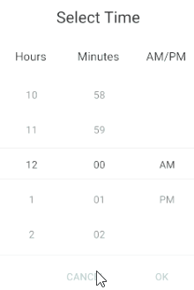

# Key Features

The purpose of this help article is to show you the key features of the Time Picker control for Xamarin. 

## Time Range

Time Picker allows you to define a time range and choose a time in between through the following properties:

* **MinimumTime**(*TimeSpan*): Defines a time which marks the beginning of the range of the available time values. The default value is `TimeSpan.Zero`.

* **MaximumTime**(*TimeSpan*): Defines a time which marks the end of the range of the available time values to choose from. The default value is `TimeSpan(23, 59, 59)`.

### Example

<snippet id='timepicker-keyfeatures-minmaxtime' />

## Current Selected Time

* **Time**(*TimeSpan?*): Defines the current time selection. The default value is null.

### Example 

<snippet id='timepicker-keyfeatures-time' />

## Incremental Time Steps

By default the TimePicker increments each part of its time values by one step. You can change the default setup using the following properties:

* **HourStep**(*int*): Controls the incremental step of the hour value. Default value is 1.
* **MinuteStep**(*int*): Controls the incremental step of the minute value. Default value is 1. 
* **SecondStep**(*int*): Controls the incremental step of the second value. Default value is 1.

<snippet id='timepicker-keyfeatures-time-steps' />

## DefaultHighlightedTime

RadTime Picker DefaultHighlightedTime(*TimeSpan*) defines the System.TimeSpan which will be used to pre-scroll each spinner when RadTimePicker.Time property is set to null.

### Example

<snippet id='timepicker-keyfeatures-time-defaulthighlighted' />

## DisplayString Format

* **DisplayStringFormat**(*string*): Defines the format of the string that will be visualized when the picker dialog is closed. 

>note The format set for **DisplayStringFormat** should be a valid time format. 

### Example

Here is a sample Time Picker definition:

<snippet id='timepicker-keyfeatures-time-defaulthighlighted' />

## IsLooping property

The TimePicker exposes **IsLooping** boolean property which indicates whether the items in the popup should loop infinitely while scrolling. By default looping is enabled, to disable it, just set **IsLooping** to *False*.

```XAML
<telerikInput:RadTimePicker IsLooping="False" />
```

Check the difference in the behavior according to **IsLooping** below:

#### IsLooping set to True (default)



#### IsLooping set to False


>important A sample Key Features example can be found in the TimePicker/Features folder of the [SDK Samples Browser application](#sdk-browser-application).

## See Also

- [Templates]()
- [Time Format Strings]()
- [Styling]()
- [Selection]()
- [Commands]()
