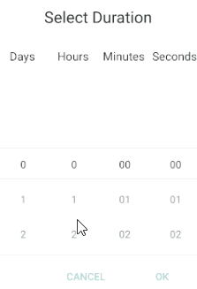

# Key Features

The purpose of this help article is to show you the key features of the TimeSpan Picker control for Xamarin. 

## TimeSpan Range

Date Picker allows you to define a date range and choose a date in between through the following properties:

* **MinimumTime**(*TimeSpan*): Defines the lowest limit of the available selection range. The default value is `TimeSpan(0, 0, 0, 0, 0)`.

* **MaximumTime**(*TimeSpan*): Defines the upper limit of the available selection range. The default value is `TimeSpan(30, 23, 59, 59)`.

>important If negaive value is set for MinimumTime, the TimeSpan Picker will coerce this value to minimum value - `TimeSpan(0, 0, 0, 0, 0)`.

### Example

<snippet id='timespanpicker-keyfeatures-minmaxtime' />

## Current Selected Time Interval

* **Time**(*TimeSpan?*): Defines the current selection of time interval. The default value is null.

### Example 

<snippet id='timespanpicker-keyfeatures-time' />

## Incremental Time Steps

By defaul the TimeSpan Picker increments each part of its time values by one step. You can change the default setup using the following properties:

* **DayStep**(*int*): Controls the incremental step of the day value. Default value is 1.
* **HourStep**(*int*): Controls the incremental step of the hour value. Default value is 1.
* **MinuteStep**(*int*): Controls the incremental step of the minute value. Default value is 1. 
* **SecondStep**(*int*): Controls the incremental step of the second value. Default value is 1.

### Example 

<snippet id='timespanpicker-keyfeatures-time-steps' />

## DefaultHighlightedTime Interval

RadTimeSpan Picker DefaultHighlightedTime(*TimeSpan*) defines the System.TimeSpan which will be visualized when there is no selection.

### Example

<snippet id='timespanpicker-keyfeatures-time-defaulthighlighted' />

## DisplayString Format

* **DisplayStringFormat**(*string*): Defines the format of the string that will be visualized when the picker dialog is closed. 

>note The format set for **DisplayStringFormat** should be a valid timespan format. 

## IsLooping property

The TimeSpanPicker exposes **IsLooping** boolean property which indicates whether the items in the popup should loop infinitely while scrolling. By default looping is enabled, to disable it, just set **IsLooping** to *False*.

```XAML
<telerikInput:RadTimeSpanPicker IsLooping="False" />
```

Check the difference in the behavior according to **IsLooping** below:

#### IsLooping set to True (default)


#### IsLooping set to False



>important A sample Key Features example can be found in the TimeSpanPicker/Features folder of the [SDK Samples Browser application](#sdk-browser-application).

## See Also

- [Templates]()
- [Styling]()
- [Commands]()
- [Selection]()
